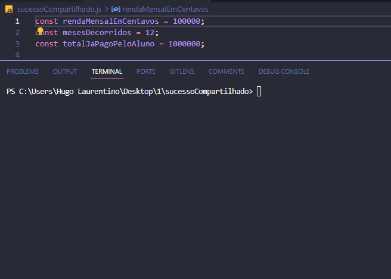

<h1 align="center">
  
</h1>

- [x] Bak-End
- [x] Criar Título
- [x] Criar Descrição
- [x] Sobre
- [x] Tecnologia
- [x] Pre requisito
- [x] Autor
- [x] GIF‘s

---
<h1 align='center'>Valor da parcela do Sucesso Compartilhado</h1>

<p align='center'>Esse é um exemplo de lógica em javascript</p>
<p align='center'>

</p>

<p align='center'>
 <a href='#sobre'>Sobre</a> |
 <a href='#pré-requisitos'>Pre Requisitos</a> |
 <a href='#tecnologias'>Tecnologias</a> |
 <a href='#autor'>Autor</a>
</p>

---
<h1 align='center'>
 
</h1>

---

### Sobre

  <p align= 'justify'>
    Na Cubos Academy alguns estudantes podem fazer o Curso de Desenvolvimento de Software e só começar a pagar após finalizado o curso quando (e se) tiverem obtido renda acima de R$ 2.000,00. Nesse caso o valor da parcela a ser paga é de 18% do valor da renda mensal da pessoal.<br>
    Após 60 meses, independente de ter quitado ou não o valor total do curso (de R$ 18.000,00) a pessoa não deve nada, ou seja, o valor da parcela é zero.

**a)** Faça um programa que calcula o valor da parcela a ser paga pelo aluno. Imprima uma mensagem bonita na tela, com o valor em reais.

    Renda Mensagem em Centavos: 3000,00
    Meses Decorridos: 12
    Total Ja Pago Pelo Aluno: 10000,00

**b)** Altere o seu programa anterior para que, quando o valor da parcela a ser pago for  0, a mensagem explique porque o aluno não precisa pagar nada naquele mês.

    Renda Mensagem em Centavos: 1500,00
    Meses Decorridos: 12
    Total Ja Pago Pelo Aluno: 10000,00
    </p>

---

### Pré-requisitos

Antes de começar, você vai precisar ter instalado em sua máquina as seguintes FERRAMENTAS: [GIT](https://git-scm.com/), [Node.js](https://nodejs.org/en/download).
Além disto é bom ter um editor para trabalhar com o código como [VSCode](https://code.visualstudio.com/download).

### 🎲 Rodando o Back End

```bash
# Clone este repositório
$ git clone https://github.com/hugolaurentino/sucessoCompartilhado.git

# Acesse a pasta do projeto no terminal/cmd
$ cd sucessoCompartilhado

# Instale as dependências
$ npm install

# Execute 
$ node .\sucessoCompartilhado.js

```
### Tecnologias

As seguintes ferramentas foram usadas na construção do projeto:

- [Node.js][nodejs]

---
###### tags: `lógica` `matemática` `nodeJS`
## Autor
Feito com ❤️ por Hugo Laurentino 👋🏽 [Entre em contato!](https://www.linkedin.com/in/hugo-laurentino-silva/)

[nodejs]: https://nodejs.org/
